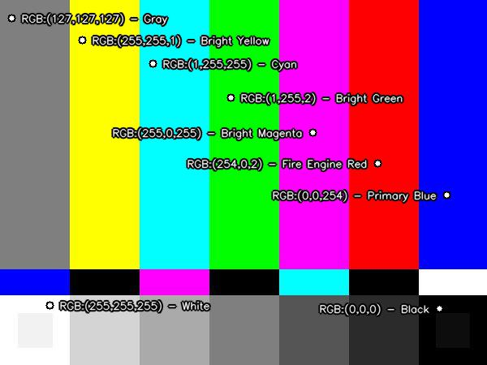

# 🎨 Color Recognition using OpenCV


## 📌 Overview

This project is an interactive color recognition application built with Python and OpenCV.

The program allows users to click anywhere on an image and instantly identifies the closest matching color based on its RGB values. Instead of using a small predefined list, the application downloads the XKCD color database containing over **950 unique color names**, providing much more accurate color recognition.

If an internet connection is unavailable, the program automatically switches to a built-in backup color database.

---

## ✨ Features

- Detects the RGB value of any clicked pixel.
- Identifies the closest matching color name.
- Uses the XKCD color database (950+ colors).
- Automatically falls back to a backup database when offline.
- Detects neutral colors (White, Gray, and Black) separately for better accuracy.
- Displays the detected color name directly on the image.
- Smart text positioning prevents labels from going outside image boundaries.
- Simple and interactive mouse-click interface.

---

## 🛠 Technologies Used

- Python 3
- OpenCV
- urllib
- JSON

---

## 💻 Development Environment

- Visual Studio Code

---

## 📂 Project Structure

```
OpenCV-Color-Recognition
│
├── images
│   ├── test_image.jpg
│   ├── test_result.jpg
│   ├── cat.jpg
│   └── people.jpg
│
├── color_detector.py
└── README.md
```

---

## ⚙️ How It Works

1. The program loads the input image.
2. It downloads the XKCD color database containing more than 950 color names.
3. If downloading fails, a backup color database is used.
4. When the user clicks on a pixel:
   - The RGB value is extracted.
   - Neutral colors are checked first.
   - Euclidean distance is calculated between the selected pixel and every color in the database.
   - The closest matching color name is returned.
5. The RGB values and detected color name are displayed on the image.

---

## ▶️ How to Run

1. Install the required library:

```bash
pip install opencv-python
```

2. Place your image inside the project folder.

3. Update the image path if necessary:

```python
image_path = "test_image.jpg"
```

4. Run the program:

```bash
python color_detector.py
```

---

## 🖱 Example Usage

- Open the image.
- Click anywhere on the image.
- The application displays:
  - RGB values
  - Closest color name

---

## 📸 Screenshots

### Test Image


### Detection Result



---

## 📚 References

- OpenCV Documentation
- XKCD Color Survey Database

---

## 👨‍💻 Author

**Nawaf Alharbi**
